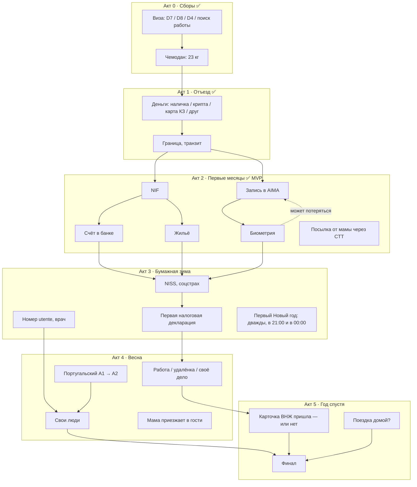
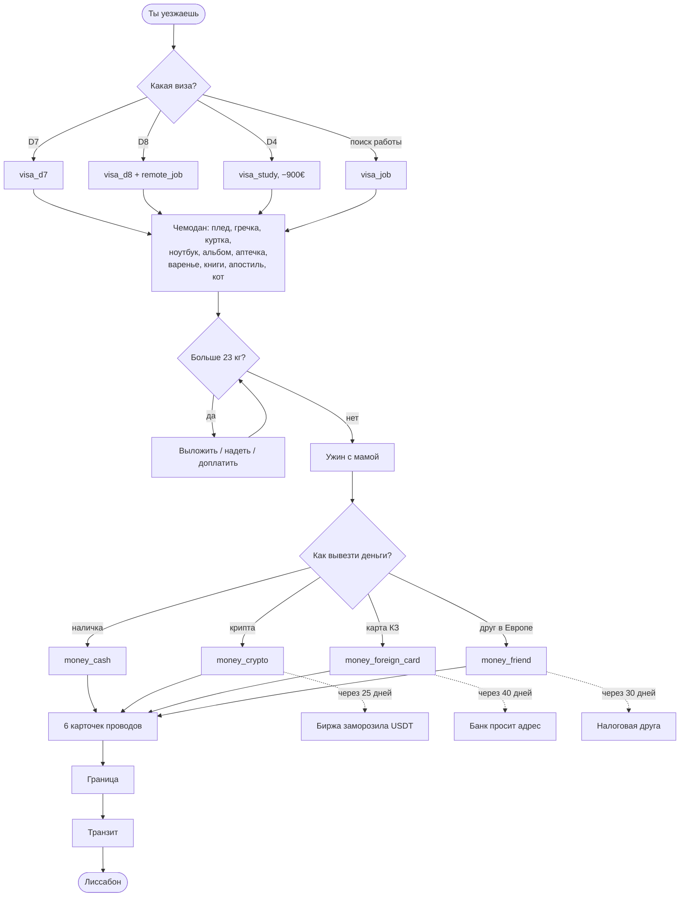
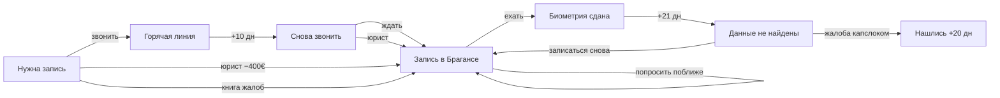
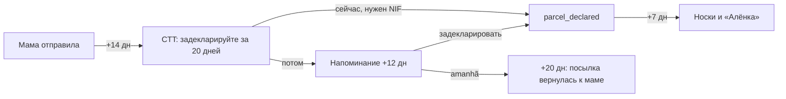

# Дерево прогресса и дерево решений

Два разных дерева:

- **Дерево прогресса** — что игрок «собирает» за партию: документы, жильё, работа, язык, люди. Это скелет, на который вешаются карточки.
- **Дерево решений** — как выборы ветвят сюжет и где «выстреливают» отложенные последствия.

Цель — **одна полная партия ≈ 45–60 минут** и повод пройти ещё раз (другая виза, другие вещи в чемодане, другие концовки).

## Бюджет времени

| | MVP (сейчас) | Полная игра |
|---|---|---|
| Акты | 3 | 6 |
| Уникальных карточек | 91 | ~320 |
| Карточек за партию | ~70 | ~220–250 |
| Время партии | ~17 мин | ~50–60 мин |
| Концовок | 5 | 10–12 |

Цифры MVP — из симулятора (`python3 tools/content.py`), 14 секунд на карточку. Полная игра — прикидка по той же скорости.

## Дерево прогресса (вся игра)

### Вехи прогресса

| Веха | Флаг | Акт | Что открывает |
|---|---|---|---|
| Виза | `visa_*` | 0 | ветку карточек своей визы |
| NIF | `has_nif` | 2 | банк, декларацию посылки, аренду |
| Счёт | `has_bank` | 2 | (акт 3) зарплату на португальский счёт, налоги |
| Жильё | `has_flat` | 2 | плесень, холод, соседей, кота и хозяина |
| Биометрия | `biometrics_done` | 2 | (акт 3) ожидание карточки ВНЖ |
| NISS | `has_niss` | 3 | официальную работу |
| Utente | `has_utente` | 2–3 | врача, (акт 4) дружбу с сеньорой Фатимой |
| Язык | `pt_course` + шкала «своя тут» | 2–4 | диалоги без англ., экзамен A2 |
| ВНЖ | `residence_card` | 5 | хорошие концовки, поездку домой без риска |

## Дерево решений (MVP)

### Отложенные последствия (самое интересное)

Выбор в начале «выстреливает» через десятки минут. Это главный приём: игрок забывает, что взял плед, — и плед спасает его в январе.

| Выбор | Когда | Что происходит |
|---|---|---|
| Взять плед | акт 2, холодная ночь | кнопка «Укрыться бабушкиным пледом»: +кукуха, +дом |
| Взять куртку | акт 2, холодная ночь | кнопка «Спать в пуховике» |
| Взять гречку | акт 2, соседи | ужин с семьёй из Харькова, +своя тут |
| Взять варенье | прилёт | банка разбилась, документы пахнут абрикосом |
| Взять аптечку | акт 2, болезнь | кнопка «Мамина аптечка» вместо клиники за 90 € |
| Второй ноутбук | акт 2, мало денег | продать на OLX за 350 € |
| Кот с собой / у мамы | акт 2 | хозяин против кота / мама шлёт фото кота на твоей подушке |
| Виза D8 | акт 2 | работодатель увольняет из-за паспорта |
| Сдать квартиру | акт 2, D7 | «позвонить жильцам» — реальный пассивный доход |
| Посылка: «потом разберусь» | +12 дней, +20 дней | напоминание, потом посылка уезжает обратно к маме |
| AIMA: звонить / юрист / жалоба | +10…40 дней | запись в Брагансе → биометрия → «данные не найдены» |

### Цепочка AIMA

### Цепочка посылки (CTT)

## Концовки

| Концовка | Условие | Тон |
|---|---|---|
| Деньги кончились | деньги = 0 | грустная, тёплая: мама встречает на вокзале |
| Кукуха уехала | кукуха = 0 | мягкая: «попросить о помощи — тоже смелость» |
| Папка потерялась | документы = 0 | абсурдная |
| Как пахнет подъезд | дом = 0 | самая тихая и самая грустная |
| Конец первой части | MVP пройден | «продолжение следует» |
| *Своя тут* | акт 5: своя тут ≥ 70, ВНЖ | счастливая |
| *Два дома* | акт 5: дом ≥ 60 и своя тут ≥ 60 | светлая грусть — главная концовка |
| *Вернуться* | акт 5: выбор «поехать домой насовсем» | не поражение, а решение |
| *Дальше* | акт 5: предложение работы в другой стране | «чемодан снова открыт» |
| *Кот натурализовался* | кот с собой + своя тут ≥ 80 | шуточная, секретная |

У «своей тут» нет концовки по нулю: с нуля всё и начинается.

## Что ещё обсудить

1. **Мета-прогресс между партиями.** «Альбом»: каждая увиденная концовка и редкая карточка остаётся в галерее. Это главный повод перепройти, и он же даёт «час игры» суммарно, даже если одна партия короче.
2. **Выбор имени/пола героя.** Сейчас тексты написаны нейтрально, в настоящем времени, и выбор не нужен. Если захочется реплик вроде «ты устал(а)» — добавим выбор в начале.
3. **Поездка домой** — самый болезненный выбор года, в том числе из-за рисков. Как подать его честно и не превратить игру в политическое высказывание?
4. **Сколько реальной бюрократии.** Статьи и процедуры меняются каждые полгода (см. `docs/stories.md`). Предлагаю правило: суть узнаваема, номера статей и суммы — без точности до цифры, чтобы игра не устаревала.
