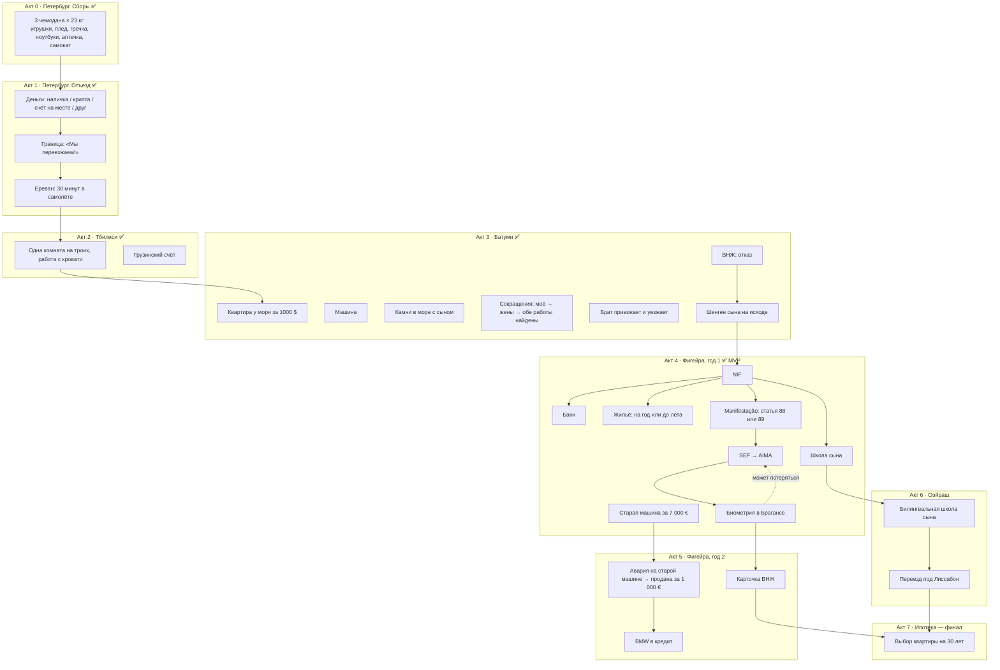
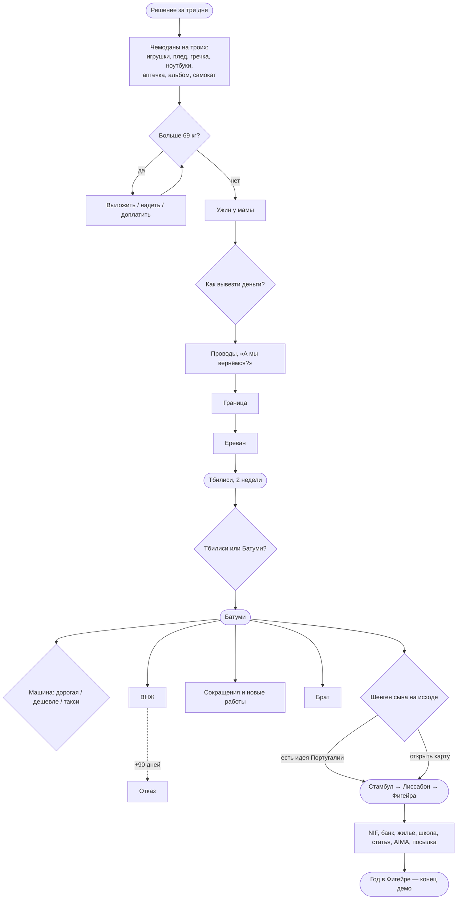
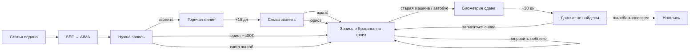

# Дерево прогресса и дерево решений

Два разных дерева:

- **Дерево прогресса** — что семья «собирает» за партию: документы, жильё, работа, язык, люди. Это скелет, на который вешаются карточки.
- **Дерево решений** — как выборы ветвят сюжет и где «выстреливают» отложенные последствия.

Цель — **одна полная партия ≈ 50–60 минут** и повод пройти ещё раз (другие вещи в чемодане, другие решения, другие концовки).

## Бюджет времени

| | MVP (сейчас) | Полная игра |
|---|---|---|
| Акты | 5 | 8 |
| Уникальных карточек | 134 | ~280 |
| Карточек за партию | ~128 | ~230 |
| Время партии | ~30 мин | ~55 мин |
| Концовок | 5 | 10–12 |

Цифры MVP — из симулятора (`python3 tools/content.py`), 14 секунд на карточку.

## Дерево прогресса (вся игра)

### Вехи прогресса

| Веха | Флаг | Акт | Что открывает |
|---|---|---|---|
| Грузинский счёт | `has_ge_bank` | 2 | кнопку «показать грузинский счёт» в португальском банке |
| Машина в Батуми | `has_car` | 3 | продажу при отъезде; «могли дешевле» |
| Идея Португалии | `portugal_idea` | 3 | кнопку «В Португалию» при истекающем шенгене |
| NIF | `has_nif` | 4 | банк, квартиру, школу, статью, декларацию посылки |
| Жильё | `has_flat_pt` | 4 | плесень, холод, соседей, конец демо |
| Статья подана | `applied_mi` | 4 | переименование SEF → AIMA, запись на биометрию |
| Биометрия | `biometrics_done` | 4 | (акт 5) карточку ВНЖ |
| Старая машина | `old_car` | 4 | поездку в Брагансу на машине; (акт 5) аварию |
| Мечта о билингве | `bilingual_dream` | 4 | (акт 6) переезд в Оэйраш |

## Дерево решений (MVP)

### Отложенные последствия

| Выбор | Когда | Что происходит |
|---|---|---|
| Взять плед | зима в Батуми и в Фигейре | «Укрыть сына бабушкиным пледом», потом «бабушка» в Фигейре |
| Взять гречку | Батуми | в супермаркете — полка гречки по три лари |
| Взять все игрушки | Батуми | железная дорога из Петербурга посреди батумской гостиной |
| Самокат отдельным местом | Батуми | семь километров бульвара |
| Детская аптечка | Батуми, Фигейра | температура ночью, отит — аптечка вместо клиники |
| Старый ноутбук | сокращение | продать |
| Деньги через крипту / друга | +40 / +60 дней | заморозка USDT / налоговая друга |
| Грузинский счёт | португальский банк | выписка помогает открыть счёт |
| Квартира до лета | +150 дней | июнь: хозяйка сдаёт туристам вчетверо дороже |
| Камень из Батуми | Фигейра | бросить в Атлантику — «пусть познакомятся» |
| Посылка: «потом» | +12, +20 дней | напоминание, потом посылка уезжает к маме |
| Подать статью | SEF → AIMA | запись в Брагансе → «биометрия не найдена» |

### Деньги

Регулярные деньги — одна карточка раз в полтора месяца в четырёх вариантах: две зарплаты / только моя / только жены / ни одной (см. `docs/decisions.md`). Сокращения переключают вариант, новые работы — возвращают.

### Цепочка AIMA

## Концовки

| Концовка | Условие | Тон |
|---|---|---|
| Деньги кончились | деньги = 0 | грустная: сын спрашивает, увидит ли он ещё море |
| Кукуха уехала | кукуха = 0 | мягкая: жена записывает к врачу |
| Папка потерялась | документы = 0 | абсурдная: чемоданы уже знают дорогу |
| Как пахнет подъезд | дом = 0 | самая тихая и самая грустная |
| Конец первой части | год в Фигейре | «продолжение следует» |
| *Свои тут* | финал: ипотека подписана, «свой тут» ≥ 70 | счастливая |
| *Два дома* | финал: дом ≥ 60 и свой тут ≥ 60 | светлая грусть — главная концовка |
| *Вернуться* | финал: выбор вернуться | не поражение, а решение |
| *Дальше* | финал: предложение работы в другой стране | «чемодан снова открыт» |

## Что ещё обсудить

1. **Сложность.** Сейчас при случайных выборах до конца доходят ~97% партий: игра прощает. Для автобиографии это, по-моему, правильно — но можно сделать жёстче.
2. **Галерея концовок и редких карточек** — повод перепройти.
3. **Финал-ипотека.** Подписать на тридцать лет — это «мы остаёмся». Как подать, чтобы было и смешно (банк, оценщик, «T2 с потенциалом»), и честно?
